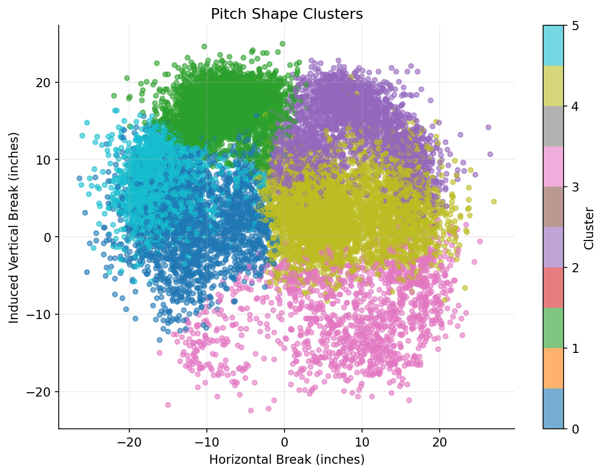

# Dodgers Quant Portfolio

Author: Drew Goldman  
Santa Monica, CA

Collection of baseball analytics experiments built using Python and public Statcast-style pitch data.

## Projects

### 1. Pitch Shape Clustering

Clustering analysis of pitch movement and velocity features.

### 2. Swing Decision Model

Classification model for swing/take outcomes using pitch location and movement features.

### 3. Run Value Decision Engine

Exploratory modeling of context-dependent run value from pitch outcomes.

## Running Project 1

```bash
python -m src.project1_pitch_shape.main
```

Or:

```bash
bash scripts/run_project1.sh
```

Optional explicit runs:

```bash
python -m src.project1_pitch_shape.main --start-date 2024-03-28 --end-date 2024-04-30 --clusters 6
python -m src.project2_swing_decision.main --start-date 2024-03-28 --end-date 2024-04-30
python -m src.project3_run_value.main --start-date 2024-03-28 --end-date 2024-04-30
```

Shell helper:

```bash
bash scripts/run_project1.sh
```

## Example Output



Sample run: March 28-31, 2024.

- Clusters were fit on movement and velocity features from a four-day Statcast sample.
- The initial separation produces broad movement-based pitch families rather than pitcher-specific arsenals.
- The output is most useful as a starting point for pitcher-level review and outcome analysis.
